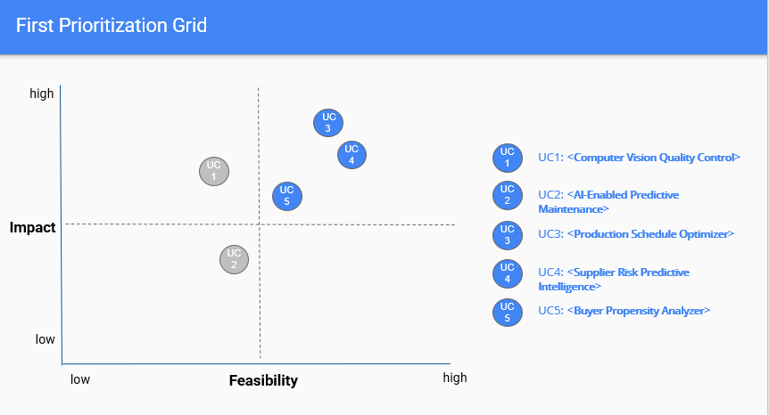

<h1> AI-ML Strategy Project (Paradigm Shift) </h1>
This project provides Business Leaders an opportunity to apply their knowledge gained in Artifical Intelligence/Machine Learning field towards a practical, hands-on scenario and  formulate a cohesive AI strategy for a Electric Vehicle car manufacturer that is trying to make a transformational and paradigm shift in business. The project is very critical for teh EV car maker to deliver a data driven strategy to solve some of its critical business problems.

* **The project scenario:** The CEO has launched an initiative to use Machine Learning and Artificial Intelligence technologies in key, high-leverage areas of a business. They’ve tasked the team with first developing ideas for many use cases for implementing ML and AI, then narrowing the use cases down to a shorter list to be implemented using a structured business approach for prioritizing the uses cases.

* In each project step, the team  analyzes each use case from one of the perspectives they've reviewed, then they prioritize and eliminate some of the use cases. At the end, the team create a final proposal on the short list of use cases to be implemented.

* **The Project covers:**
  * *A Paradigm Shift:* The team narrows down from 10 to 5 use cases in this step that are most viable in terms of the faesibility and the impact that they will produce. 
  
  
  * *Mathematical Constraints as a Filter:* The 5V's corresponding to Volume, Variety, Velocity, Veracity and Value of the data available for each of the use case are analyzed and applied to narrow down to 3 use cases.  
**For Ex:**
 

  * *Business Architecture:* The Business architecture for the uses along with any common patterns are plotted and anlayzed to further narrow down on the use cases. Some hard choice around the data and the architecture are now made with the above available information to narrow down further to 2 uses cases.
  * *Operational Considerations:* Accuracy, Bias and Ethics are applied for the final 2 use cases to consider the opeational considerations when the 2 use cases are implemented and productionalized. 
  * *A Feedback and Outreach survey* is conducted with all important stakeholders of the business problem to solicit their understanding of the problem, the expectations of the solution improving the day-to-day operations, the value proposition that the solution would bring, and the concerns around the problem space and solution proposed. 
  * *The Operational considerations and feedback/surveys* are considered together for the implementation of the final use cases. Risk and Mitigations are outlined and an implementation approach for the final 2 use cases are outlined.    
